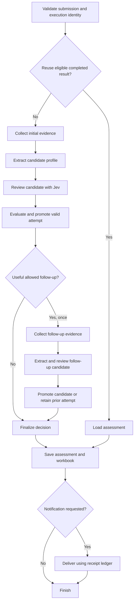

# LangChain workflow refactoring plan

Reviewed on 2026-09-23. This was the proposed design before the migration. The [architecture guide](architecture.md) describes the implementation.

The goal is a cleaner, more observable lead-qualification workflow, with an installable `src/` package, shorter files, and automated formatting. Preserve the product's intent: evidence-backed qualification, explicit uncertainty, bounded research, explainable decisions, and reliable delivery. Existing behavior is evidence about that intent, not the acceptance specification.

Use LangGraph to express the workflow, LangChain for structured OpenAI calls, and LangSmith as an optional trace viewer. Keep Jev's typed judgments and Python's policy evaluation. Local records remain usable without a hosted tracing account.

Keep this as a uv project. `pyproject.toml`, `uv.lock`, and `.python-version` remain the project configuration, dependency lock, and development interpreter selection. Manage dependencies, environments, execution, and builds through uv.

## Current state

The application has 2,826 lines across five root Python modules. The automated suite passes: 61 tests in 0.87 seconds using `uv run pytest`. This verifies the current mocked and local tests; it does not validate live model quality or framework compatibility.

| Module | Current responsibility | Assessment |
| --- | --- | --- |
| `main.py`, 488 lines | Configuration, CLI, research orchestration, reassessment, files, workbook, notification, saved-run repair | The main redesign target. `process_lead` combines execution state, business decisions, and delivery. |
| `assessment.py`, 933 lines | OpenAI extraction, schema adjustments, Jev request construction and parsing, accepted claims, policy, scoring, summaries | Split provider integration from domain decisions. There is useful business logic to retain. |
| `discovery.py`, 481 lines | SearXNG, Firecrawl, certificate context, URL checks, retries, research budgets | Retain the adapters and explicit limits. Expose research operations and failures in traces. |
| `models.py`, 426 lines | Inputs, evidence, claims, judgments, results, delivery records | Retain useful domain types. Add explicit workflow and attempt records. |
| `delivery.py`, 498 lines | Atomic files, Excel formatting and updates, Slack formatting and transport | Separate report generation from delivery state and external writes. |

The intended workflow is already clear in the original implementation plan: research, propose a cited profile, verify it with Jev, permit one useful compliance follow-up, decide in Python, save, and optionally notify. A custom graph is a good fit for this predetermined sequence. The framework's distinction between workflows and agents supports that choice. [LangGraph overview](https://docs.langchain.com/oss/python/langgraph/overview), [workflows and agents](https://github.com/langchain-ai/docs/blob/main/src/oss/langgraph/workflows-agents.mdx).

Specific findings that shape the redesign:

- Completed-result reuse is keyed by lead identity. Employee band, policy, and model configuration are not checked before reuse. A changed employee band can receive the old assessment. Lead identity and assessment freshness need separate contracts.
- Model attempt files are saved after the assessment sequence. A process crash can lose an already completed model attempt, even though research was saved earlier.
- Follow-up research replaces the current research variable before the candidate profile and review succeed. The code retains the previous profile and review on failure. Model judgments and their evidence snapshot need explicit links so the authoritative attempt is unambiguous.
- Malformed Jev answers receive constructed fallback choices or score distributions. Validation errors usually force review, but these fallback objects obscure the distinction between actual provider output and missing judgments. Preserve the sanitized received payload separately and represent invalid answers explicitly.
- `company_profile_schema` adds enum constraints and a country pattern beyond the Pydantic schema. Passing `CompanyProfile` directly to a framework helper would lose those request constraints unless the models or schema builder change deliberately.
- `tests/test_main.py` has only two tests. Domain tests cover useful cases, including unsupported claims, routing, jurisdiction roles, and competitor probabilities. Workflow branch and recovery coverage is much thinner.
- Slack already distinguishes confirmed, failed, and uncertain delivery. There is still a crash window between external acceptance and saving the receipt. Checkpointing cannot establish whether an external system accepted an unrecorded request.

## Intent and acceptance rules

Treat these as the starting product contract. Change a rule only in a commit that explains the intended change and supplies a concrete example.

1. A result is traceable to a normalized submission, dated policy, evidence snapshot, profile proposal, and review.
2. A supported compliance flag wins over uncertainty in another check. Missing or invalid evidence cannot qualify a lead as sales ready.
3. Python owns arithmetic and final routing. Preserve the current score table and thresholds as explicit policy defaults pending separate calibration.
4. Every accepted factual summary sentence has valid citations and passes review. Valid JSON alone is insufficient.
5. One assessment execution permits three initial searches and four distinct initial page requests, with at most one additional search and page. Transport retries are counted separately and remain bounded.
6. OpenAI proposes claims. Jev verifies claims and supplies typed judgments. Its competitive-overlap question evaluates raw evidence, with the proposed profile clearly labeled as a proposal.
7. A follow-up can improve the assessment once. A failed candidate cannot partially overwrite the authoritative assessment. Preserve accepted flags and route unresolved cases to review.
8. Business outcome, execution outcome, and delivery outcome are separate. A successfully processed rejected lead is not an execution failure. A Slack failure does not invalidate the assessment.
9. The workbook contains one current row per lead. New executions retain their own audit records.
10. Notification retry does not invoke research or either model. Uncertain sends require explicit retry and retain the duplicate warning.
11. Every branch decision and external operation is observable. Hosted tracing failure does not block qualification; failure to save required audit records does.

## Target design

Use a small application interface that accepts a submission and execution options and returns an assessment result plus execution metadata. The CLI creates dependencies and renders progress. Graph nodes accept typed state updates and call modules through small interfaces.

| Module | Interface and responsibility |
| --- | --- |
| Domain | Typed submissions, evidence, attempts, judgments, fit, compliance, and decisions. No LangChain imports. |
| Research | Collect initial evidence or a targeted follow-up with explicit budgets and per-operation records. |
| Profile extraction | Produce a validated profile, provider metadata, and evidence-snapshot reference. LangChain owns the model invocation. |
| Jev review | Return actual typed judgments or explicit invalid-answer records, linked to a profile and evidence snapshot. |
| Decision | Compute accepted claims, compliance, fit, final status, and follow-up eligibility. Return reason codes and evidence references. |
| Workflow | Define stages, conditional edges, candidate promotion, and terminal failure handling. |
| Run storage | Persist immutable attempt artifacts, execution identity, current-result selection, and stage completion. |
| Reporting and delivery | Generate Excel and Slack representations, publish the workbook, and maintain notification receipts. |
| Observability | Correlate stages, attempts, decisions, provider calls, and delivery operations across local records and hosted traces. |

Use one installable Python package under `src/` and a temporary compatibility CLI entry point. Avoid a framework class for each existing function. Inject network clients, storage, and the model adapters; pure decision functions need no wrapper interface.

### Repository layout

Use this target layout. The tree lists the intended implementation modules; package directories also contain minimal `__init__.py` files. Add recovery modules when their implementation step arrives rather than creating empty placeholders.

```text
pyproject.toml
uv.lock
.python-version
README.md
.env.example
src/
    docktape_lead_agent/
        __init__.py
        __main__.py
        cli.py
        settings.py
        application.py
        domain/
            submissions.py
            evidence.py
            profiles.py
            judgments.py
            results.py
            compliance.py
            scoring.py
            acceptance.py
        workflow/
            graph.py
            state.py
            nodes.py
        research/
            clients.py
            collection.py
            urls.py
            http.py
        inference/
            profile.py
            jev_questions.py
            jev_review.py
        storage/
            runs.py
            checkpoints.py
        reporting/
            workbook.py
            notification.py
        delivery/
            slack.py
            receipts.py
        observability.py
        resources/
            policy.json
tests/
    unit/
    contracts/
    workflow/
    integration/
    fixtures/
    conftest.py
evals/
    cases/
    run.py
examples/
    submissions/
    evidence/
docs/
    architecture.md
    refactoring-plan.md
output/
```

`application.py` assembles dependencies and exposes run, inspect, and retry operations. `cli.py` parses arguments and presents results. `workflow/graph.py` declares the graph and edges; it does not contain provider requests or policy calculations. `workflow/nodes.py` contains small stage functions, with related stages split into named modules only if this file grows beyond its responsibility.

Domain types are grouped by concept rather than collected in a new large `models.py`. Compliance, scoring, and acceptance remain independently readable modules. Research owns network collection and evidence construction. Inference owns prompts and provider response handling. Reporting renders results, delivery handles external notification state, and storage owns assessment artifacts and atomic file operations.

Dependencies flow from the CLI and application into workflow and adapters, then into domain types and functions. Domain code imports neither workflow nor network or framework libraries. Keep imports explicit and `__init__.py` files small. Avoid catch-all `utils.py`, `helpers.py`, or `services.py` modules.

Move example submissions and synthetic evidence out of runtime package data. Keep the default dated policy inside package resources and load it with `importlib.resources`; ensure the wheel includes it. An explicit policy-path override can support custom policy files. Keep one authoritative default policy rather than copies in both `data/` and package resources. Generated runs remain outside `src/`. Preserve existing delivery evidence as historical artifacts. The existing untracked demo is separate from the Python package and is not moved as part of this layout change.

Add the `uv_build` build backend in `pyproject.toml`, using its standard `src/docktape_lead_agent` layout, and define `docktape-lead-agent` under `[project.scripts]`. Select a compatible bounded backend version during implementation. The current project has no build-system declaration; adding one lets `uv sync` install the application itself in editable mode alongside its dependencies. Use `uv run docktape-lead-agent` as the primary command and support `uv run python -m docktape_lead_agent` through a minimal `__main__.py`. Keep the old root `main.py` as a forwarding shim during migration, then remove it after documentation and callers use the uv entry point. [uv project configuration](https://docs.astral.sh/uv/concepts/projects/config/).

Add runtime dependencies with `uv add` and development tools with `uv add --dev`, keeping Ruff alongside pytest and respx in the existing dev dependency group. Commit corresponding changes to `pyproject.toml` and `uv.lock` together. Keep the existing Python selection in `.python-version` unless dependency compatibility requires an explicit change. Use `uv sync` for local setup and `uv run` for project commands; no separate environment activation or manual editable-install step is required.

Use the installed package in tests. Remove the current `pythonpath = ["."]` workaround and use pytest's importlib import mode. Do not replace it with `sys.path` edits or a `PYTHONPATH=src` requirement. Verify both editable development installation and a wheel installed in a clean environment outside the repository, including default-policy loading. This catches missing package resources and accidental imports from the checkout. [Python packaging layouts](https://packaging.python.org/en/latest/discussions/src-layout-vs-flat-layout/), [pytest integration practices](https://docs.pytest.org/en/stable/explanation/goodpractices.html).

### File size and formatting

Aim for implementation files around 100 to 250 lines. Review a file for splitting when it exceeds 300 lines or combines unrelated responsibilities. These are review guidelines, not a mechanical line-count gate. Keep short related types together and allow entry points to be much smaller. Extract functions when they isolate a decision, transformation, or external operation; avoid one-line forwarding layers added only to lower a file's line count.

Split the current large modules along these responsibilities:

| Current file | Destination responsibilities |
| --- | --- |
| `main.py` | CLI, settings, application construction, graph, run storage |
| `assessment.py` | Profile inference, Jev questions and review, compliance, scoring, accepted claims |
| `models.py` | Submission, evidence, profile, judgment, and result types |
| `discovery.py` | Research clients, collection strategy, URL validation, bounded HTTP requests |
| `delivery.py` | Workbook rendering, notification rendering, Slack transport, receipts, atomic storage |

Use Ruff for formatting, import sorting, and linting, configured in `pyproject.toml` and locked as a development dependency. Set the Python target to 3.13 and line length to 100, with four-space indentation and double quotes. Start linting with `E4`, `E7`, `E9`, `F`, `I`, `UP`, and `B`; handle intentional exceptions narrowly. Let the formatter wrap expressions and collections, and manually split long prompt text at sentence boundaries without changing the text supplied to models. [Ruff configuration](https://docs.astral.sh/ruff/configuration/).

Annotate public functions and graph state. Use concrete result types instead of unstructured dictionaries where a contract exists. Document invariants and non-obvious failure behavior; omit docstrings that repeat a function's name.

Use uv for local checks. In CI, install uv through `astral-sh/setup-uv`, pin the chosen uv release, and use locked dependency resolution so an outdated lockfile fails rather than being silently updated. Run:

```sh
uv sync --locked --group dev
uv run --locked ruff format --check src tests evals
uv run --locked ruff check src tests evals
uv run --locked pytest
uv build
```

The wheel smoke check also uses uv to create an isolated environment and install the built artifact. Run its CLI outside the checkout to verify packaged imports and resources. [uv GitHub Actions integration](https://docs.astral.sh/uv/guides/integration/github/).

Before `src/` exists, run Ruff against the five existing application modules and `tests/`. Include the root forwarding shim while it exists. Add `evals/` to check commands when created. Apply formatting in a dedicated commit, and review lint fixes separately from file moves and workflow changes so semantic changes remain visible.

### Workflow shape



The diagram groups related steps for readability. Profile extraction and Jev review remain separate graph nodes and trace spans in both attempts. Expected provider failures route to explicit terminal or fallback handling. Programming errors retain an internal diagnostic trace and mark the execution failed.

Represent the follow-up with a finite path. Its terminal path cannot request another follow-up. Keep an explicit budget in state as an additional check. Do not use a generic agent loop or a recursion limit as the research budget.

### State and provenance

Keep `lead_id` stable for tracker identity. Add `execution_id` for each assessment execution, an input fingerprint for qualification-relevant input, and version references for policy, prompts, model configuration, schema, and workflow. Store resolved model versions when returned. Provider aliases such as `jev-latest` require an explicit refresh or freshness policy because an unchanged alias does not prove an unchanged model.

Use separate immutable attempt records. Each attempt links its evidence snapshot, candidate profile, review, validation errors, and decision. Keep one authoritative-attempt reference. Promote a follow-up only after its profile and review satisfy the attempt contract. Preserve valid independent judgments when another answer is invalid, but never represent a missing answer as an actual probability distribution.

Graph state should contain serializable values or artifact references, stage status, budget usage, and the authoritative-attempt reference. Runtime context supplies credentials, clients, and storage handles. Do not checkpoint those dependencies.

Store full research snapshots once per attempt and refer to them in traces. Version persisted data. Keep an importer for existing completed records so old runs remain inspectable without pretending they have complete new provenance.

### LangChain integration

Use `langchain-openai` and `langchain-core`; add `langgraph` for orchestration. Use direct dependencies only where the application imports them. Add the LangSmith SDK for custom spans and the SQLite checkpoint integration when durable resume is introduced. Use `uv add` to resolve a compatible set on Python 3.13 and update `uv.lock` instead of choosing unverified version pins in this plan.

Implement extraction with `ChatOpenAI`, explicit Responses API selection, native JSON Schema structured output, and strict validation. Preserve `store=False`, configured model selection, requested and returned model metadata, bounded timeout/retries, refusal handling, incomplete-output handling, and citation validation. Verify the actual outbound payload and error mapping against the pinned library version. Use the current constrained schema first; subsequently replace schema patching with more precise claim types if it simplifies the contract. [ChatOpenAI integration](https://docs.langchain.com/oss/python/integrations/chat/openai).

Keep Jev as an HTTP adapter called by a graph node. Use a named runnable or custom trace span where needed for trace nesting. Do not implement a chat-model abstraction for an interface whose output is typed probability judgments.

Retain the existing SearXNG, Firecrawl, and certificate clients initially. Their budgets, URL checks, truncation, and evidence metadata are part of the research contract. Generic document loaders are only worth adopting if they demonstrably satisfy that contract with less code.

### Observability contract

One execution has a parent trace. Named child spans show research, extraction, review, decisions, persistence, workbook publication, and notification. Research spans include individual searches and page fetches. Model spans include each actual request attempt so retries and costs remain visible.

Record execution and lead identifiers, assessment attempt, evidence snapshot, stage, start/end time, outcome, retry count, budget usage, requested/resolved model, prompt/policy versions, and token usage where available. Unknown usage remains unknown. Add structured branch reasons such as `follow_up_not_useful`, `follow_up_budget_exhausted`, `identity_unverified`, and `compliance_flag_accepted`.

A local execution manifest, stage artifacts, and structured event log are the durable audit. Use one event shape with a local sink and an optional LangSmith sink. Avoid duplicating complete evidence in every event. LangSmith provides trace names, metadata, tags, and parent-child correlation; explicitly instrument Jev and non-model operations too. Flush hosted trace submission before the short-lived CLI exits. [LangSmith tracing](https://docs.langchain.com/langsmith/trace-with-langchain).

Trace exports use an allowlist of operational fields and exclude credentials, webhook URLs, and contact details. Full local evidence remains available through referenced artifacts. Test nested payload masking because model inputs currently contain submission data. [LangSmith input and output masking](https://docs.langchain.com/langsmith/mask-inputs-outputs).

Acceptance example: from a `review_required` result, an operator can find the failed jurisdiction check, its evidence, the follow-up decision, the second attempt's failure, the retained authoritative attempt, and stage timings without reconstructing those facts from several unrelated files.

### Recovery and delivery

Introduce SQLite checkpoints after graph behavior and audit records are stable. Checkpoints record execution progress; the run store owns business artifacts. Resume an incomplete execution with the same execution identifier. A refresh creates a new identifier under the same lead. Legacy completed-result reuse, resume, refresh, and notification retry are separate operations. [LangGraph persistence](https://docs.langchain.com/oss/python/langgraph/persistence).

Checkpoint stage completion and immutable artifact references. Make repeated writes idempotent. A provider response received just before a crash may still be lost before persistence; do not promise exactly-once model calls. Persist per-request completion if recovery must avoid repeating completed research within a larger node.

Before enabling automatic recovery around Slack, save a send-intent record. An intent with no terminal receipt is uncertain on restart and must not automatically resend. Retain explicit notification retry and duplicate reporting. Hash the actual versioned notification payload, including blocks, rather than only its plain-text rendering. Save the receipt before refreshing display projections.

Keep workbook writes serialized. Parallel lead processing is a later design change, not a consequence of adopting LangGraph.

## Implementation sequence

Each numbered item is a proposed commit-sized step. Split a step further if its review becomes large. Keep the existing CLI usable while the new workflow is developed behind an explicit engine selection. New behavior is judged by the intent contract; old output comparison is a diagnostic aid.

1. **Record intended outcomes.** Build a decision table for clean leads, supported flags, unknown size, unsupported identity, conflicting jurisdictions, reviewer disagreement, failed follow-up, and notification uncertainty. Classify existing tests as product intent, integration contract, or incidental implementation. Gate: every retained policy rule has a concrete example.

2. **Establish formatting and the installable layout.** Deliver this step as four small commits: 2a adds Ruff configuration and a formatting-only pass; 2b resolves selected lint findings and adds CI checks; 2c moves the application into the `src/` package, configures the build and entry points, packages the default policy, and fixes imports; 2d separates CLI, settings, and dependency construction. During 2c, large files may exist temporarily inside the package until subsequent responsibility splits. Remove pytest's root-path workaround and verify a clean wheel install outside the checkout. Gate: formatting, lint, the existing 61 tests, installed CLI help, and packaged-policy loading pass. The temporary root command still works.

3. **Extract domain modules.** Group models into submission, evidence, profile, judgment, and result modules. Move arithmetic, compliance evaluation, accepted-profile construction, and routing away from provider calls into focused domain modules. Return structured reasons and evidence references with decisions. Separate structural moves from changes to decision records. Gate: intent examples pass without model mocks or network access; domain imports do not depend on adapters or LangChain.

4. **Introduce execution and attempt records.** Add versioned execution metadata, input/configuration fingerprints, evidence snapshots, and an authoritative-attempt reference. Gate: round trips retain provenance and reject incompatible or incomplete records explicitly.

5. **Separate Jev transport, parsing, and decisions.** Preserve received answers separately from validation results. Replace fabricated fallback probabilities with explicit unavailable or invalid judgments. Gate: one malformed answer causes appropriate uncertainty while independently accepted flags remain visible.

6. **Add stage records and trace correlation.** Instrument the existing path with named stages and local events first. Connect optional LangSmith spans, including Jev and HTTP operations. Gate: a failed assessment is understandable from recorded stages; nested payloads do not export secrets or contact details.

7. **Implement the LangChain profile adapter.** Lock dependencies, wire the explicit structured-output request, and map provider results to the domain contract. Gate: mocked HTTP contract tests cover strict constraints, storage settings, refusals, incomplete output, missing citations, metadata, and exact retry limits.

8. **Implement the initial graph path.** Build validation, initial research, extraction, review, decision, and finalization nodes using injected adapters. Persist an attempt as each stage completes. Gate: deterministic fakes produce the intended clean, flagged, uncertain, and failed results through the application interface.

9. **Add the bounded follow-up path.** Return a structured eligibility decision, enforce the remaining budget, and stage a second candidate separately. Gate: follow-up occurs only when useful and permitted; no third assessment occurs; candidate failure leaves the first attempt coherent and auditable.

10. **Separate reports and delivery from assessment.** Render workbook rows and notification payloads from finalized results. Use a separate publication path for reused results and delivery retries. Gate: workbook failure prevents sending; notification retry performs zero research and model calls.

11. **Correct completed-result reuse.** Compare qualification input and assessment configuration fingerprints, and record the reuse reason. Treat legacy records without fingerprints as inspectable but ineligible for automatic freshness claims. Gate: a changed employee band or policy cannot silently reuse the old assessment; unchanged eligible input still updates one lead row.

12. **Close the unrecorded-send recovery gap.** Persist send intent before transport, store terminal receipts, and mark interrupted sends uncertain. Version and hash the full notification payload. Gate: injected crashes before/after send and receipt storage never cause an automatic uncertain resend.

13. **Add durable graph resume.** Introduce a SQLite checkpointer and map executions to graph threads. Reconcile checkpoint references with durable artifacts, and keep refresh distinct from resume. Gate: a restarted process resumes from completed durable work, without mixing attempts or losing consumed research budget.

14. **Complete the operator view.** Show stage progress and final record/trace identifiers in the CLI. Add an inspect command or compact local run report showing branch reasons, timings, budgets, warnings, model metadata, and delivery status. Gate: an operator can answer why a lead was routed to review without reading source code.

15. **Evaluate semantic quality and switch the default.** Run the intent corpus through recorded provider outputs, then a separately budgeted live evaluation with delivery disabled. Compare decisions, accepted citations, unresolved cases, request counts, and latency. Explain differences from the old engine using the intent table. Gate: deterministic rules pass and live differences have been reviewed against evidence.

16. **Remove obsolete orchestration and finish the layout.** Delete the old engine, root forwarding shim, and temporary compatibility imports once cutover passes. Retain legacy record reading where useful. Move architecture and planning documents under `docs/` and examples under `examples/`, updating links and commands. Document inspect, resume, refresh, delivery retry, trace configuration, and schema-version handling. Review any implementation file above 300 lines for mixed responsibilities. Gate: one supported execution path, reproducible package installation, passing formatting and lint checks, and a passing offline suite.

## Testing and evaluation

Keep tests that assert domain decisions, external integration contracts, and observable failure behavior. Replace tests that require monkeypatching orchestration globals with tests through injected adapters and the application interface. Do not snapshot entire graph state or freeze generated prose.

| Test group | Assertions |
| --- | --- |
| Domain decisions | Score thresholds, direct-cloud requirement, flag precedence, supported jurisdictions, uncertainty, accepted summary citations |
| Provider contracts | Actual outbound schema/settings, refusal/incomplete results, malformed Jev answers, bounded retries, model metadata |
| Workflow scenarios | Initial success/failure, single follow-up, failed candidate retention, synthetic research isolation, no follow-up after an accepted flag |
| Storage and recovery | Attempt persistence, changed-input invalidation, legacy reads, crash/restart, checkpoint/artifact consistency |
| Reporting and delivery | One tracker row per lead, literal Excel text, escaped Slack mentions, persist-before-send, receipt reuse, unknown-send handling |
| Observability | Parent-child correlation, branch reasons, request counts, timings, masked exports, optional hosted tracing failure |
| Live evaluation | Evidence-supported judgments on clean, ambiguous, alias, unrelated-name, and unlisted-competitor cases |

Use existing domain and HTTP tests as prior art. Expand workflow coverage where the architecture changes. Seed evaluations with Bitrise, Qovery, and Holori, but assign expectations from reviewed evidence snapshots rather than company names or historical outcomes. Keep deterministic tests offline and live evaluations separate. Record evaluation prompt, policy, model versions, and evidence date.

## Scope and delivery gates

The first useful milestone is steps 1 through 9: explicit intent, separated decisions, traceable adapters, and a functioning graph including follow-up. The second is steps 10 through 14: coherent publication, freshness, recovery, and inspection. Finish with semantic evaluation and removal of duplicate orchestration.

The definition of done is that a maintainer can explain any result from its recorded evidence and decisions, inspect every meaningful stage, and modify a workflow branch without editing provider transport or workbook formatting. Application code lives in an installable `src/` package, files have focused responsibilities, and CI enforces formatting and lint checks. The application must still produce the required lead assessment and outputs with tracing disabled and run from an installed wheel outside the checkout.

Autonomous research planning, a human approval UI, multi-agent supervisors, vector search, batch concurrency, provider replacement, scoring calibration, and a production sanctions system are outside this refactor. A `review_required` outcome remains a saved business result; it does not become a suspended human-review session implicitly.

Only this planning document was added during the review. Runtime code, dependencies, demo content, saved runs, and external services were not changed by the plan.
